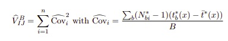

```{r setup, include=FALSE, echo = F}
library(rmdformats)
knitr::opts_chunk$set(fig.align = "center")
knitr::opts_chunk$set(warning = FALSE)
knitr::opts_chunk$set(message = FALSE)
knitr::opts_chunk$set(comment = "")
knitr::opts_chunk$set(fig.width = 16)
knitr::opts_chunk$set(fig.height = 9)
```

# Problem definition 

Probability of Default is a basic and crucial parameter used in Credit Risk. Traditionally, it is based on credit scorecards which are built with logistic regression. However, the scope of informations available for the bank is different for various clients. If the customer is our current client (e.g. he has a bank account), we can access the data concerning his behaviour and assets. Hence, we can assume that estimated probability of default for this client is more precise than for a corresponding customer that does not have an account at our bank. 

> Therefore, we would like to propose an innovative approach into calculating Probability of Default, which could also assess the level of uncertainty of the calculated PD. 

# Theoretical background and literature review

## Using Random Forest for credit risk models

The employment of Machine Learning models in credit risk modelling is put into doubt, in particular for regulatory purposes because of the "black box" effect. Nonetheless, usage of Machine Learning techniques is beneficial as it can help improve general model predictive power.

Decision trees are very intuitive models. The basic intuition behind a decision tree is to draw all possible decision paths so that they shape a tree. Each path from the root to a leaf forms a decision process. 

> Random forest is based on a simple but powerful concept - the wisdom of crowds.

Random forest consists of a large number of decision trees. Each tree is built on a random sample of the observations and for each tree of the forest a random set of features is chosen to split nodes. Then, when predicting a class variable, there is a plurality vote performed so that in the end one decision is made.

Random Forests are known to computationally demanding but with R you can run computations on multiple cores in parallel, lowering the computation time.

| pros                                                                                                                | cons                                                                             |
|---------------------------------------------------------------------------------------------------------------------|----------------------------------------------------------------------------------|
| • Limits overfitting<br>• High accuracy<br>• Easy choice of relevant variables<br>• Handles well missing values<br> | • Low interpretability<br><br>• Parameter choice (number of trees, depth etc...) |

## Confidence intervals for random forests

We can estimate confidence intervals for random forests using formula proposed by researchers from Stanford in the paper "Confidence Intervals for Random Forests: The Jackknife and the Infinitesimal Jackknife" (Wager et al.). This means that we can estimate standard errors for random forests. Methods proposed by the authors are based on the jackknife and the ifinitesimal jackknife.

The infinitesimal jackknife is an alternative to the jackknife where, instead of studying the behavior of a statistic when we remove one observation at a time, we look at what happens to the statistic when we individually down-weight each observation by an infinitesimal amount. When the infinitesimal jackknife is available, it sometimes gives more stable predictions than the regular jackknife. 



# Implementation in R

### Libraries
To start with, we need to load the required libraries. For random forest we'll be using the ranger package. Then we'll use plotting2 to plot the results, with the fantastic theme provided by the director of data science at Airbnb. 
```{r libraries}
library(ranger)
library(tidyverse)
library(ggplot2)
library(ggthemes)
library(ggtech) # For the airbnb theme
library(extrafont) # To add the font for Airbnb theme
library(mice) # Imputation
library(knitr)

theme_set(theme_airbnb_fancy())
pink = "#FF5A5F"
orange = "#FFB400"
blueGreen = "#007A87"
flesh = "#FFAA91"
purple = "#7B0051"
options(scipen=999) #avoiding e10 notation
```

### Experiment #1 - uneven groups
To start, we wanted to see the effect of a different number of observations within each group. If the model were to behave as expected, the group with fewer observations should have a wider margin of confidence.   

To test this, we prepared an artificial dataset. We try to predict the default probability as a factor of the type of employment. The two options are: salary and self employed. The analysis is based on historical data and such we have an imbalanced set: 10 000 people on salary, and only 500 self employed.   

The results are promising - the less populated group does indeed have a much higher margin of error. It also seems to follow the general limit theorem - the number of observations in the salaried group is 20 times bigger, but the variance is only about 4.5 times smaller. 

```{r uneven_groups, cache = TRUE}
# Create the articilial dataset with uneven groups
didDefault <- c(c(rep(1, 165) , rep(0, 10000 - 165)),
                c(rep(1, 57), rep(0, 500 - 57)))

self_employed <- c(rep(0, 10000), rep(1, 500))
data <- tibble(self_employed=factor(self_employed), didDefault = factor(didDefault))

# Run the Random Forest
rf <- ranger("didDefault ~ .", data=data, probability = T, keep.inbag=TRUE)

# Predict the results, including the sd
res2 <- predict(rf, data, type ='se')
res2 <- tibble(pred_prob = res2$predictions[,2], se = res2$se[,2])
res2 <- cbind(data ,res2)

# Group the results and add the confidence intervals
# Then plot 
res2 %>% group_by(self_employed) %>% 
  summarise(n_def = sum(didDefault == 1),
    n = n(),
    pd = mean(pred_prob),
            se = sqrt(mean(se^2)),
            pd_low = pd - 1.96 * se,
            pd_up = pd + 1.96 * se) %>%
  ggplot(aes(x = factor(self_employed), y = pd)) +
  geom_point(color = blueGreen, size = 7) +
  geom_errorbar(aes(ymin = pd_low, ymax = pd_up), size = 3, width = 0.1, color = blueGreen, alpha = 0.5) + 
  labs(
    title = 'Probability of default - type of employment',
    subtitle = 'Salary: 10 000, Self employed: 500',
    x = '',
    y = 'Probability of default'
  ) + 
  scale_x_discrete(labels = c('Salary (n = 10 000)', 'Self employed (n = 500)')) +
  scale_y_continuous(labels = scales::percent_format(accuracy = 1), limits = c(0, 0.16)) 
```

### Experiment #2 - even groups

In the previews experiment, the default probability was very different for the two groups. To exclude the possibility of this influencing the variance, we prepared a second experiment. This time the groups are more or less even, but the default rate is different.   

The data is also artificial - we are simulating the influence of marital status on the pd. We have 10 000 observations of married people and 9 000 singles.  

And the results are also promising - the groups seem to have similar margins of confidence, despite having very different probabilities of default. 

```{r even_groups, cache = TRUE}
# Like above, but with even groups
didDefault <- c(c(rep(1, 165) , rep(0, 10000 - 165)),
                c(rep(1, 320), rep(0, 9000 - 320)))
self_employed <- c(rep(0, 10000), rep(1, 9000))
data <- tibble(self_employed=factor(self_employed), didDefault = factor(didDefault))

rf <- ranger("didDefault ~ .", data=data, probability = T, keep.inbag=TRUE)

res2 <- predict(rf, data, type ='se')
res2 <- tibble(pred_prob = res2$predictions[,2], se = res2$se[,2])
res2 <- cbind(data ,res2)

res2 %>% group_by(self_employed) %>% 
  summarise(n_def = sum(didDefault == 1),
            n = n(),
            pd = mean(pred_prob),
            se = sqrt(mean(se^2)),
            pd_low = pd - 1.96 * se,
            pd_up = pd + 1.96 * se) %>%
  ggplot(aes(x = factor(self_employed), y = pd)) +
  geom_point(color = blueGreen, size = 7) +
  geom_errorbar(aes(ymin = pd_low, ymax = pd_up), size = 3, width = 0.1, color = blueGreen, alpha = 0.5) + 
  labs(
    title = 'Probability of default - marital status',
    subtitle = 'Married: 10 000, Single: 9 000',
    x = '',
    y = 'Probability of default'
  ) + 
  scale_x_discrete(labels = c('Married (n = 10 000)', 'Single (n = 9 000)')) +
  scale_y_continuous(labels = scales::percent_format(accuracy = 1), limits = c(0, 0.042)) 
```

### Experiment #3 - real data
To push the experiments further, we searched for a real dataset. We found a promising database from Taiwan, consisting of 30 000 observations and 23 variables.  

After importing the data, cleaning it and removing outliers, we imported it into the model. This time, we are taking a slightly different approach. We are running a 3-fold cross validation on this data to get the OOS probability and variance. 

For the plot below, we are using a new metric - "Model confidence". Since this is a binary classification problem, we calculate the model confidence as (1 - standard error) * 100%. Thous 100% means that the model is absolutely confident in it's prediction and lower means that it starts to loose confidence. It has to be noted, that we calculate standard error and PD for each observation individually.   

The results are very interesting - it seems that the model is very confident when it predicts PD near 0% and 100%, but it starts to loose confidence for some observations when the predicted probability is closer to 50%. 

```{r real_data, eval = TRUE, cache = T}
# Read processed data
# The code for processing can be found on GitHub, not included here for brevity
# Includes outlier removal and data cleaning
data <- read_csv("data/processed/credit_default_clean.csv")

# Remove the id column
data <- data[,-1]

target <- 'didDefault'
data[,target] <- factor(data[[target]])

# This function runs k fold cross validation and append following columns to original data:
# id - row number from data
# pred_prob - OOS predicted probability of default
# se - estimated OOS standard error
rf_cv <- function(data, n_folds=3){
  form <- formula("didDefault ~ .")
  
  folds <- sample(rep(c(1:n_folds),ceiling(nrow(data)/n_folds)), size = nrow(data))
  results <- list()
  
  for(i in 1:n_folds){
    # Build the model on training data
    rf_fit <- ranger(formula=form, 
                     data=na.omit(data[folds != i ,]), 
                     probability=TRUE,
                     keep.inbag=TRUE) 
    
    # Generate predictions and standard errors for test set
    pred <- predict(rf_fit, data=na.omit(data[folds == i,]), type = "se")
    
    results[i] <- list(as_tibble(list(id = which(folds==i), 
                                      pred_prob = pred$predictions[,2], 
                                      se = pred$se[,2])))
    
  }
  results <- do.call(rbind, results)
  results <- results %>% arrange(id)
  results <- cbind(data, results)
  return(results)
}

# Run the CV
res <- rf_cv(data, 3)

res$trueResult <- as.integer(res$didDefault) - 1

# Plot the results
ggplot(res) +
  geom_jitter(aes(x = pred_prob, y = 1 - se, color = 1 - se), alpha = 0.4) +
  scale_color_gradient(high = orange, low = purple) +
  labs(title = 'Model confidence vs predicted probability of default',
       subtitle = 'Mean probability of default: 26.7%',
       x = 'Probability of default',
       y = 'Model confidence') +
  theme(legend.position = 'none') +
  scale_x_continuous(labels = scales::percent_format(accuracy = 1))
```


### Experiment #4 - coverage of intervals
```{r, eval = TRUE, cache = T}
cv_results <- map(1:3, function(x) rf_cv(data, 3))

for(i in 1:3){
  cv_results[[i]]$rep <- i
}

cv_results <- do.call(rbind, cv_results)

res$prob_bin <- res$pred_prob %>% 
  cut_width(width=0.1,boundary=0)

# Aggregating probability of default, true default rate and se per probability bin

tmp <- cv_results  %>% 
  mutate(prob_bin = cut_width(pred_prob, width=0.1, boundary=0)) %>% 
  group_by(rep, prob_bin) %>% 
  summarise(prob = mean(pred_prob), 
            se = sqrt(mean(se^2)),
            prop = mean(didDefault == 1),
            n = n())


# Visualizing how well model predicts per probability bin

tmp %>% 
  ggplot(aes(x = prop ,
             y = prob)) +
  geom_point() +
  geom_errorbar(aes(ymin = prob - 2*se, ymax = prob  + 2*se)) +
  geom_abline(slope = 1, lty = 2, color = 'blue') + 
  xlab("Fraction of defaults") + 
  ylab("Preidcted probability of default") +
  ggtitle("OOS probability of default vs True fraction of defaults")
```

Next, we bin observations by predicted probability of default and in those bins compare expected fraction of defaulters with true fraction. That way we can see if our standard error estimates provide a good margin of conservatism.


### Experiment #4 - missing data

To improve on feedback received during our pitch we decided to test how our method can deal with missing values among independent variables.
To accomplish that we artificially remove value of some variables for 50% of the observations from the test set (20% observations). Next we performed repeated imputation using Predictive Mean Maching using "mice" library. For each of the imputed datasets we performed prediction using Random Forest model fitted on training dataset. Final estimate of standard error is equal to root of sum of average variance of prediction between imputations and average variance estimated using infinitesmall jacknife.


Table below shows a standard error conditional on if the observations had missing values. We can see that it is larger for group with missing data.

```{r, eval = TRUE, cache = T, echo=T, results='hide'}
# Read processed data
data <- read_csv("data/processed/credit_default_clean.csv")
# Remove id column
data <- data[,-1]
target <- 'didDefault'
factor_vars <- c("didDefault", "isFemale", "isMarried",  "education_high_school", "education_university", "education_graduate_school")

for(var in factor_vars){
  data[,var] <- factor(data[[var]])
}

train_test_ind <- function(data=data,pctTrain=0.8)
{
  # fcn to create indices to divide data into random
  # training, validation and testing data sets
  N <- nrow(data)
  train <- sample(N, pctTrain*N)
  test <- setdiff(seq_len(N),train)
  Ind <- list(train=train,test=test)
  return(Ind)
} 

ind <- train_test_ind(data)
ind$missing <- sample(ind$test,  floor(length(ind$test)/2))

rf <- ranger(didDefault ~., data=data[ind$train,], 
             probability=TRUE,
             keep.inbag=TRUE)

data_missing = data
cols_missing <- c( "PAY_0", "PAY_2", "PAY_3",  "PAY_4", "PAY_5", "PAY_6", "BILL_AMT1", "BILL_AMT2",
                   "PAY_AMT2",  "PAY_AMT3",  "PAY_AMT4",  "PAY_AMT5",  "PAY_AMT6")
data_missing[ind$missing, cols_missing ] = NA

n_imputations=5

imputed <- mice(as.data.frame(data_missing), m=n_imputations, maxit = 5, method = 'pmm', seed = 500)
imputed <- 1:n_imputations %>% map(function(x) complete(imputed, action = x)[ind$test,])
```


```{r, eval = TRUE, cache = T}
make_pred <- function(data){
  pred <- predict(rf, data=data, type ='se')
  tibble(se = pred$se[,2], pred = pred$predictions[,2])
}

test_preds <- imputed %>% map(make_pred)
for(i in 1:n_imputations){
  test_preds[[i]][,'imp'] = i
}
test_preds <- do.call(rbind, test_preds)
test_preds[,'id'] <- rep(1:length(ind$test), n_imputations)

test_result <- test_preds %>% 
  mutate(w = 1/se^2) %>% 
  group_by(id) %>% 
  summarise(sd(pred))

test_result <- test_preds %>% 
  mutate(w = 1/se^2) %>% 
  group_by(id) %>% 
  summarise(agg_pred = sum(pred*w)/sum(w),
            agg_se = sqrt(sum(se^2 * w^2)/ sum(w)^2),
            se_pred = sd(pred)/sqrt(5),
            total_se = sqrt(agg_se^2 + se_pred^2))

test_result$had_na <- apply(is.na(data_missing[ind$test,]), 1, any)

test_result %>% 
  group_by(had_na) %>%
  summarise(se = round(sqrt(mean(total_se^2)),3)) %>% 
  kable(caption = "RMSE depending if observation had missing values")

```

Plot below shows confidence of the model on y-axis and probability of default on y-axis. We can still see that confidence is lower when probability is close to 50%, but also there is strong decrease in confidence if there are missing observations.

```{r, eval = TRUE, cache = T}
test_result <- cbind(data[ind$test,],test_result)

test_result %>% 
  ggplot(aes(x= agg_pred, y=total_se, color = had_na)) +
  geom_jitter(aes(x = agg_pred, y = 1 - total_se), alpha = 0.4) +
  labs(title = "Confidence depending if observation had missing values",
       x = 'Probability of default',
       y = 'Model confidence') +
  theme(legend.title = element_text("Had missing value")) +
  scale_x_continuous(labels = scales::percent_format(accuracy = 1))
```

Finally, we repeat our previous analysis, where we bin observations by predicted probability of default and in those bins compare expected fraction of defaulters with true fraction. That way we can see if our standard error estimates provide a good margin of conservatism. We can see that our predictions 
are less accurate for observations with missing values and the uncertainty is reflected by the width of confidence intervals.

```{r, eval = TRUE, cache = T}


tmp <- test_result  %>% 
  mutate(prob_bin = cut_width(agg_pred, width=0.2, boundary=0)) %>% 
  group_by(prob_bin, had_na) %>% 
  summarise(prob = mean(agg_pred), 
            se = sqrt(mean(total_se^2)),
            prop = mean(didDefault == 1),
            n = n())


# Visualizing how well model predicts per probability bin

tmp %>% 
  ggplot(aes(x = prop ,
             y = prob)) +
  geom_point() +
  geom_errorbar(aes(ymin = prob - 2*se, ymax = prob  + 2*se)) +
  geom_abline(slope = 1, lty = 2, color = 'blue') + 
  facet_wrap(vars(had_na)) +
  xlab("Fraction of defaults") + 
  ylab("Predicted probability of default") +
  ggtitle("OOS probability of default vs True fraction of defaults") +
  labs(title="OOS probability of default vs True fraction of defaults",
       subtitle = "Depending if observations had missing values")
```


### Missing data - alternative solution

Initially, we were going to use other approach for missing data, however, we have not found working implementation of required methods.
The approach would omit the step of imputation and instead would on-the-fly imputation during prediction and standard error estimation.
On-the-fly imputation is described in Tang, F., & Ishwaran, H. (2017) in following words:

> 1.  Only non-missing data is used to calculate the split-statistic for splitting a tree node.
> 2.  When assigning left and right daughter node membership if the variable used to splitthe node has missing data, missing data for that variable is “imputed” by drawing arandom value from the inbag non-missing data.
> 3.  Following a node split, imputed data are reset to missing and the process is repeateduntil terminal nodes are reached. Note that after terminal node assignment, imputeddata are reset back to missing, just as was done for all nodes.
> 4.  Missing data in terminal nodes are then imputed using OOB non-missing terminalnode data from all the trees.  For integer valued variables, a maximal class rule isused; a mean rule is used for continuous variables."

Author's claim to implement this method in R packages - randomForestSRC, but in our experience it is unstable and origin of crashes is probably within C layer. Therefore, we were unable to use it succesfully.

# Potential uses and summary

In the era of Big Data and Artificial Intelligens, banks are prone to adopt evolving techniques as they help get better insights from data, reduce cost and increase overall profitability. With no doubts, using machine learning models is a must in financial world for in order to stay competitive.

Machine Learning and Credit Risk is be a suitable marriage - for example, it can help in areas where traditional methods disappoint, like estimating measure of uncertainty of probability of default for new clients, for which not all data is available. 

Our method is based on random forests and estimating confidence intervals using infinitesimal jackknife. In our analysis we proved that our method meets the requirements set by the client.

> 1. Proposed method takes into account the scope of available information

> 2. Proposed method takes into account the number of similar observations


# Sources 

### Confidence intervals for Random Forest
Wager, S., Hastie T., & Efron, B. (2014). Confidence Intervals for Random Forests: The Jackknife and the Infinitesimal Jackknife. J Mach Learn Res 15:1625-1651

### Dataset
Yeh, I. C., & Lien, C. H. (2009). The comparisons of data mining techniques for the predictive accuracy of probability of default of credit card clients. Expert Systems with Applications, 36(2), 2473-2480.
https://archive.ics.uci.edu/ml/datasets/default+of+credit+card+clients

### Random Forest Missing Data Algortihms
Tang, F., & Ishwaran, H. (2017). Random forest missing data algorithms. Statistical Analysis and Data Mining: The ASA Data Science Journal, 10(6), 363-377.
https://arxiv.org/abs/1701.05305


